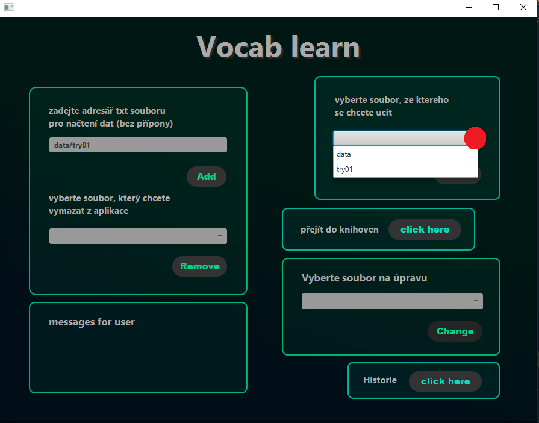
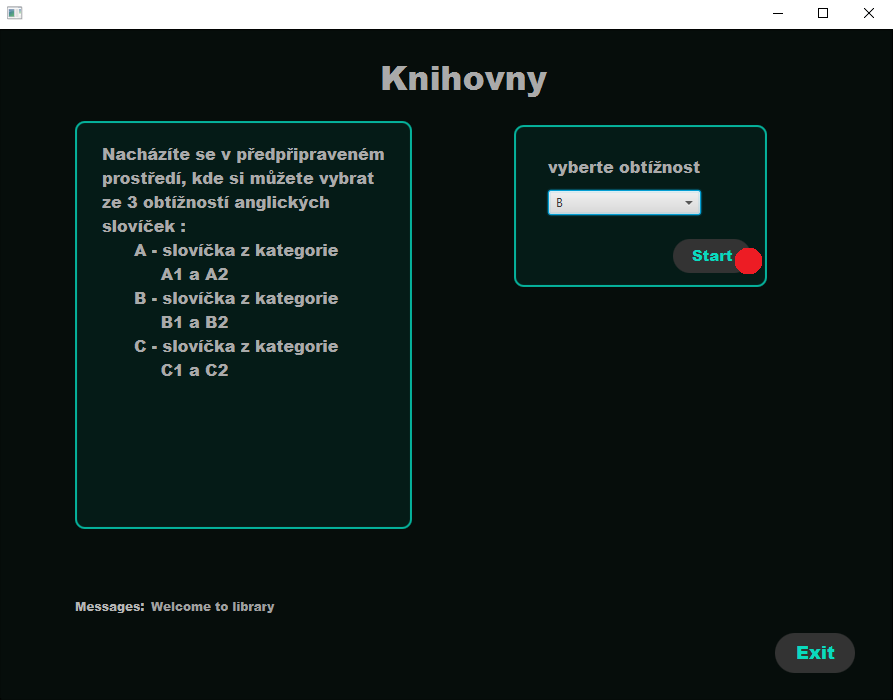

# Learning app with javafx GUI

## Popis problému
Program slouží pro učení se slovíček a bude v GUI dělané pomocí javafx. Uživatel si bude moci přes GUI zadat cesty ke svým txt souborům se slovíčky, či vybrat jednu z knihoven, ze kterých se může učit. Po vybrání souboru, či knihovny se může slovíčka učit. Učení je jednoduchým principem "otáčející se karty", kde na jedné straně je význam slova v jednom jazyce a na druhém jeho překlad, překladem je míněno slovo v jazyce, které se chcete naučit. Poté stačí klikat na tlačítko next, které načte další slovíčko v pořadí, u každého slovíčka je zde také tlačítko "know already", které po zmáčkunít přestane dané slovíčko zobrazovat při dalším procházení. Jako další funkce je zde upravování svých txt souborů, kde je možnost slovíčko přídat, odebrat, či jen setřídit slovíčka v textovém souboru a uložit jej. Poté zde bude možnost historie, kde budou zobrazovány záznamy kolik slovíček, z jakého souboru a jaký den se člověk naučil.

## Zadání

1.Menu, které umožní opakovaný výběr funkcí aplikácie a ukončení aplikace

2.Přehledný výpis výsledků na konzoli - použijte alespoň jednou String.format() a StringBuilder

3.Načítání vstupních dat z minimálně dvou souborů 

4.Zápis výstupních dat do souboru

5.Možnosť práce s textovými a binárními soubory (alespoň někde)

6.Ideálně využití reálných otevřených dat

7.Adresář data se všemi datovými soubory a případně třídu Datastore se statickými metodami, které budou poskytovat další statická data.

8.Tri balíčky: 
+	a. 	ui – třídy, tvořící uživatelské rozhraní - komunikaci s uživatelem
+ b. 	app – třídy, tvořící logiku s daty aplikácie - modely, kontrolery
+ c. 	utils – pomocné třídy např. vlastní výjimky, vlastní rozhraní
                
9.Programování vůči rozhraní a použití vlastního rozhraní

10.Použití java.time API pro práci s časem

11.Použít enum typ

12.Použití kontejnerové třídy jazyka Java (ArrayList, LinkedList, HashMap ...) z Collections frameworku.

13.Alespoň dvě možnosti třídění s využitím rozhraní Comparable a Comparator 

14.Použití regulárního výrazu

15.Ošetření vstupů, aby chybné vstupy nezpůsobily pád programu - pomocí existujících a vlastních výjimek

16.Vhodné ošetření povinně ošetřovaných výjimek

17.Použití Vámi vybrané externí knihovny (audio, posílání emailů, práce s obrázkem, junit testování, jiné formáty uložení dat ...)

18.Javadoc - každá třída a metoda musí mít javadoc popis, abyste mohli na závěr vygenerovat javadoc dokumentaci. 

## Jednotlivá okna a jejich funkce (Funkční specifikace)
### Hlavní menu

+ Add - přidání souboru
+ Remove - odebrání vybraného souboru z aplikace
+ Change - upravování vybraného souboru (přesunutí do okna change)
+ Start - po vybrání souboru, přesunutí do okna Proces Učení
+ Knihovny - přesun do okna Knihoven ze kterých se můžeš učit
+ Historie - přesun do okna Historie, kde jsou záznamy o počtu naučených slovíček
### Úprava

+ remove - odstranění slovíčka z daného souboru
+ add - přidání slovíčka z daného souboru
+ sort by name - setřídit slovíčka v souboru podle slovíčka v prvním jazyce
+ sort by translation - setřídit slovíčka v souboru podle slovíčka v druhém jazyce
+ save - uložení/zapsání změn do daného souboru
### Knihovny

+ vybrat knihovnu A/B/C
+ start - po vybrání z knihoven, přesunutí do okna Proces Učení
### Historie

+ clear history - vymazání všech záznamů z historie
### Proces učení

+ kliknutím na "kartu" se zobrazí překlad slovíčka
+ next - přesunutí na další slovíčko
+ knowAlready - tlačítko po zmáčknutí způsobí další nezobrazování daného slovíčka při dalších cyklech

## Popis struktury
### TXT soubory
+ String word
+ String translation
+ oddělení pomocí "="
+ příklad: "učit se=learn"
### Binární soubory
+ LocalDate - datum záznamu
+ String - jméno daného souboru
+ Integer - počet naučených slov

## Diagram (zjednodušený)            

## Příklad funkčnosti 1 (přes vlastní txt soubor)
### vlastní txt soubor

### přidání txt do programu

### vybrání souboru

### učení se ze souboru

## Příklad funkčnosti 2 (přes knihovnu)
### vstup do knihovny

### vybrání knihovny

### zahájení

### učení se z knihovny

